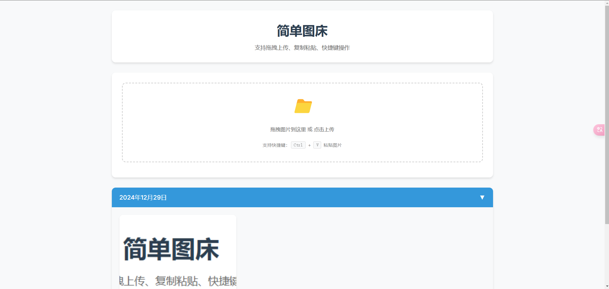

# Tuku - 图片上传服务 | Image Upload Service

[English](#english) | [中文说明](#中文说明)

<a name="english"></a>
## 🌟 Image Upload Service

A secure, efficient, and feature-rich image upload service with optional content moderation capabilities.

### ✨ Key Features

- **Secure Upload System**
  - File type and size validation
  - Automatic file extension detection
  - Secure file naming and storage
  - Protection against malicious files

- **Content Moderation**
  - Optional Baidu AI content moderation
  - Configurable during installation
  - Automatic detection of inappropriate content
  - Separate storage for non-compliant images

- **Flexible Configuration**
  - Easy installation process
  - Customizable file size limits
  - Configurable storage locations
  - Adjustable security settings

- **Robust Error Handling**
  - Detailed error logging
  - User-friendly error messages
  - Complete audit trail
  - Debug mode for development

### 🚀 Requirements

- PHP 7.4 or higher
- MySQL 5.7 or higher
- Apache/Nginx web server
- Write permissions for storage directories
- Baidu AI API credentials (optional)

### 📦 Installation

1. **Download and Upload**
- Download the latest release from GitHub
- Upload all files to your web server

2. **Web Installation**
- Visit `http://your-domain/install.php` in your browser
- Follow the simple installation wizard:
  1. System Check: Automatically checks PHP version and required extensions
  2. Directory Permissions: Verifies and sets required permissions
  3. Database Setup: Enter your database details
  4. Content Moderation: Choose whether to enable Baidu content moderation
  5. Complete: Installation finished!

That's it! Your image upload service is ready to use.

### 🔧 Configuration Options

#### Basic Configuration
```php
return [
    'upload_dir' => '/path/to/uploads',
    'max_file_size' => 10485760, // 10MB
    'allowed_types' => ['image/jpeg', 'image/png', 'image/gif']
];
```

#### Baidu Content Moderation (Optional)
```php
return [
    'enabled' => true,
    'client_id' => 'your_api_key',
    'client_secret' => 'your_secret_key'
];
```

### 🛡️ Security Features

1. **File Validation**
   - MIME type checking
   - File size limits
   - Image integrity verification
   - Extension validation

2. **Content Safety**
   - Optional AI-powered content moderation
   - Automatic flagging of inappropriate content
   - Secure storage of non-compliant images

3. **System Security**
   - SQL injection prevention
   - XSS protection
   - CSRF tokens
   - Secure file naming

### 🤝 Contributing

Contributions are welcome! Please feel free to submit a Pull Request.

---

<a name="中文说明"></a>
## 🌟 页面预览




## 🌟 图片上传服务

一个安全、高效、功能丰富的图片上传服务，支持可选的内容审核功能。

### ✨ 主要特性

- **安全的上传系统**
  - 文件类型和大小验证
  - 自动文件扩展名检测
  - 安全的文件命名和存储
  - 恶意文件防护

- **内容审核**
  - 可选的百度AI内容审核
  - 安装时可配置
  - 自动检测不当内容
  - 违规图片独立存储

- **灵活配置**
  - 简单的安装过程
  - 可自定义文件大小限制
  - 可配置存储位置
  - 可调整安全设置

- **强大的错误处理**
  - 详细的错误日志
  - 友好的错误提示
  - 完整的审计跟踪
  - 开发调试模式

### 🚀 系统要求

- PHP 7.4 或更高版本
- MySQL 5.7 或更高版本
- Apache/Nginx 网络服务器
- 存储目录的写入权限
- 百度AI API凭证（可选）

### 📦 安装步骤

1. **下载并上传**
- 从 GitHub 下载最新版本或者使用git clone下载文件
- 将所有文件上传到您的网站服务器解压到相关目录
- 设置运行目录为public
- 创建好数据库

2. **网页安装**
- 在浏览器中访问 `http://your-domain/install.php`
- 按照安装向导的提示操作：
  1. 系统检查：自动检查 PHP 版本和必需扩展
  2. 目录权限：验证并设置所需权限
  3. 数据库配置：输入数据库信息
  4. 内容审核：选择是否启用百度内容审核
  5. 完成安装：安装完成！

就这么简单！您的图片上传服务已经可以使用了。


### 视频教程
[20241229_101447.mp4](20241229_101447.mp4)

### 🔧 配置选项

#### 基础配置
```php
return [
    'upload_dir' => '/path/to/uploads',
    'max_file_size' => 10485760, // 10MB
    'allowed_types' => ['image/jpeg', 'image/png', 'image/gif']
];
```

#### 百度内容审核配置（可选）
```php
return [
    'enabled' => true,
    'client_id' => 'your_api_key',
    'client_secret' => 'your_secret_key'
];
```

### 🛡️ 安全特性

1. **文件验证**
   - MIME 类型检查
   - 文件大小限制
   - 图片完整性验证
   - 扩展名验证

2. **内容安全**
   - 可选的 AI 驱动内容审核
   - 自动标记不当内容
   - 违规图片安全存储

3. **系统安全**
   - SQL 注入防护
   - XSS 防护
   - CSRF 令牌
   - 安全的文件命名

### 🤝 参与贡献

欢迎提交 Pull Request 来帮助改进这个项目！

### 📄 开源协议

本项目采用 MIT 协议 - 详见 LICENSE 文件

